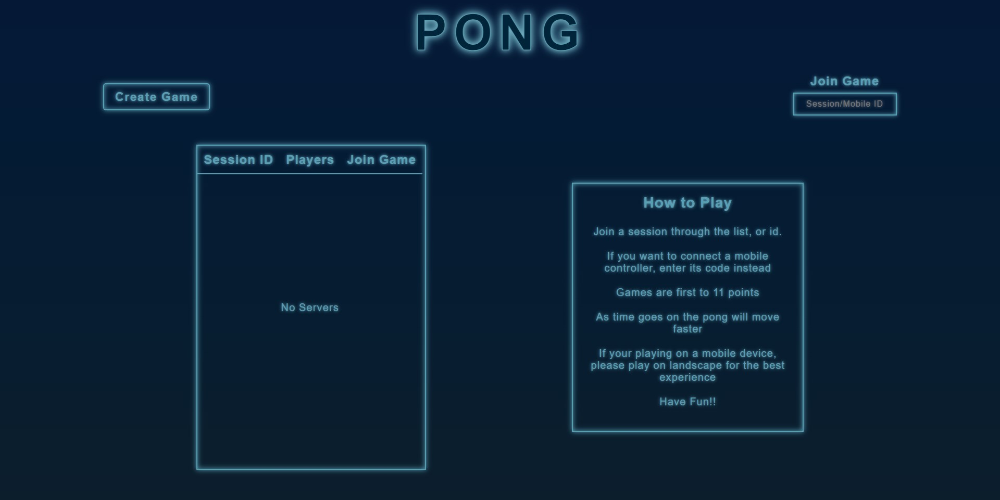
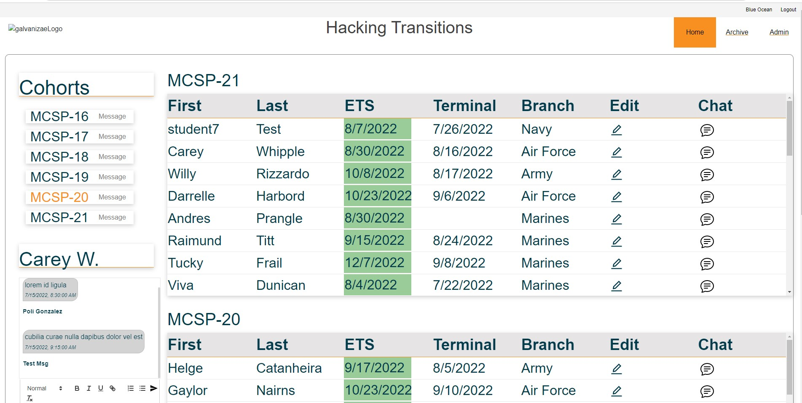

<h1 align='center'>
Hi! My name is Moses 👋
</h1>
<!-- Contacts -->

 
 

<!-- Github Stats  -->

 
  <!-- https://github.com/anuraghazra/github-readme-stats github stats   -->
   
  
  <!-- https://github.com/DenverCoder1/github-readme-streak-stats  streak url  -->  
  
   
    
  

  
  <!-- https://github.com/Ashutosh00710/github-readme-activity-graph commit graph   -->
  

<!-- Featured Projects -->
<h2 align='center' />
 Featured
</h2>

|[Synth Pong](https://github.com/moses369/Synth-Pong)  | [Hacking Transitions](https://github.com/moses369/hacking-transitions) |
| :----: |:----:|
|     | 

<!-- Tech Stack -->
<h2 align= 'center'> Tech Stack </h2> 

  
  
  
  
  
  
  

  
  
  
  

  

  

<!--
**moses369/moses369** is a ✨ _special_ ✨ repository because its `README.md` (this file) appears on your GitHub profile.

Here are some ideas to get you started:

- 🔭 I’m currently working on ...
- 🌱 I’m currently learning ...
- 👯 I’m looking to collaborate on ...
- 🤔 I’m looking for help with ...
- 💬 Ask me about ...
- 📫 How to reach me: ...
- 😄 Pronouns: ...
- ⚡ Fun fact: ...
-->
